# Runic – Autonomous AI Incident Response Agent

**Runic** is a **production-grade autonomous AI system** that detects, analyzes, and remediates infrastructure incidents with **minimal human intervention**.

It combines LLM-powered reasoning, retrieval-augmented generation (RAG), and safe workflow orchestration to create closed-loop incident response automation — emulating advanced SRE practices with strong safety guarantees and full auditability.

<p align="center">
  <em>Detect → Retrieve → Reason → Act → Verify → Learn</em>
</p>

------------------------------------------------------------------------

## ✨ Key Features

### Intelligent Incident Detection
- Ingests & normalizes alerts from diverse monitoring systems
- Rule-based + ML-based anomaly scoring

### Context-Aware Retrieval (RAG)
- Embedding-based search across logs, runbooks & historical incidents
- Dramatically reduces hallucinations and improves decision quality

### Autonomous AI Planning
- Powered by **Google Gemini**
- Produces structured plans including:
  - Hypothesis generation
  - Ordered remediation steps
  - Risk classification (low/medium/high)
  - Rollback strategy
  - Verification metrics
  - Per-step confidence scoring

### Safe & Auditable Execution
- **AWS Step Functions** orchestrates workflows
- Tool adapters for AWS, GitHub, Slack, PagerDuty, Datadog, etc.
- **Approval gating** for medium/high-risk actions
- Preflight checks, idempotency, automated rollback
- Complete audit trail in DynamoDB + CloudWatch

### Recovery Verification
- Metric-based success validation (thresholds & statistical checks)
- Automatic escalation on failure

### Continuous Learning & Postmortems
- Auto-generates RCA summaries
- Stores full incident lifecycle
- Proposes runbook improvements via **GitHub Pull Requests**

------------------------------------------------------------------------

## 🏗 Architecture Overview

```mermaid
flowchart TD
    A[Alert sources<br>Datadog • CloudWatch • PagerDuty • …] --> B[API Gateway]
    B --> C[alertNormalizer Lambda]
    C --> D[SQS Queue]
    D --> E[ingestProcessor Lambda]
    E -->|create record| F[(DynamoDB<br>Incident state)]
    E --> G[detector Lambda<br>Anomaly scoring]
    G --> H[retriever Lambda<br>+ FAISS Embeddings]
    H -->|context: logs, runbooks, history| I[planner<br>Google Gemini LLM]
    I -->|structured plan| J[AWS Step Functions]
    
    J --> K[Safety gates &<br>human approval<br>medium/high risk]
    J --> L[Tool adapters<br>AWS • GitHub • Slack • …]
    J --> M[Rollback handler]
    
    J --> N[verifier Lambda<br>Outcome validation]
    N --> O[postmortem +<br>runbookUpdater]
    O -->|RCA summary| P[GitHub Pull Request<br>runbook improvements]
    O --> F
    O --> Q[(S3<br>artifacts & evidence)]
    O --> R[AWS CloudWatch<br>logs + metrics]

    style J fill:#f9f,stroke:#333,stroke-width:2px


```


------------------------------------------------------------------------

## ⚙ Tech Stack

| Layer                | Technology              | Purpose                              |
|----------------------|-------------------------|--------------------------------------|
| LLM Reasoning        | Google Gemini           | Planning, summarization, confidence  |
| Vector Retrieval     | FAISS + Embeddings      | RAG context retrieval                |
| Workflow             | AWS Step Functions      | Safe orchestration                   |
| Compute              | AWS Lambda              | Serverless agent services            |
| State Storage        | Amazon DynamoDB         | Incident lifecycle                   |
| Artifact Storage     | Amazon S3               | Logs, postmortems, evidence          |
| IaC                  | AWS CDK (TypeScript)    | Reproducible infrastructure          |
| Auth / Approval      | Amazon Cognito          | Secure human-in-the-loop flows       |
| Observability        | AWS CloudWatch          | Metrics, logs, alarms                |
| CI/CD                | GitHub Actions          | Automated testing & deployment       |
| Frontend (optional)  | React + Vite            | Incident dashboard viewer            |

------------------------------------------------------------------------

## 🚀 Quick Start – Local Development

### Prerequisites
- Node.js ≥ 18
- Python ≥ 3.10
- AWS CLI (configured with credentials)
- AWS CDK CLI (`npm install -g aws-cdk`)
- Google Gemini API key (set as `GEMINI_API_KEY`)

### Setup

```bash
# Clone & enter directory
git clone https://github.com/<your-username>/Runic.git
cd Runic

# Frontend/infra dependencies
npm install

# Python dependencies (for lambdas, tools, etc.)
pip install -r requirements.txt
```

### Deploy to AWS (dev environment)

```bash
# Bootstrap CDK (only once per account/region)
cdk bootstrap

# Synthesize & deploy
cdk deploy --all
```

### Simulate an Incident

```bash
# Replace <api-endpoint> with the deployed API Gateway URL
curl -X POST https://<api-endpoint>/alert \
  -H "Content-Type: application/json" \
  -d @samples/sample-high-cpu-alert.json
```

Watch CloudWatch Logs or Step Functions console to follow the agent reasoning and actions.

------------------------------------------------------------------------

## Sample Planner Output (JSON)

```json
{
  "incident_id": "inc-20260205-001",
  "hypotheses": [
    "RDS connection pool exhaustion due to query spike",
    "Application memory leak causing connection hogging"
  ],
  "confidence": 0.87,
  "risk_level": "medium",
  "steps": [
    {
      "step": 1,
      "action": "Increase RDS max_connections temporarily",
      "tool": "aws.rds.modify_db_parameter_group",
      "risk": "low",
      "estimated_time": "5m"
    },
    {
      "step": 2,
      "action": "Scale application ECS service desired count +50%",
      "tool": "aws.ecs.update_service",
      "risk": "medium",
      "rollback": "Revert desired count"
    }
  ],
  "verification": {
    "metrics": ["rds.DatabaseConnections", "application.active_connections"],
    "success_threshold": "connections < 80% of max for 5 min"
  },
  "rollback_plan": "Revert parameter group & ECS desired count"
}
```

------------------------------------------------------------------------

## 🔐 Safety & Reliability Principles

- **Risk-aware execution** — every action classified before run
- **Human-in-the-loop** — mandatory approval for ≥ medium risk
- **Idempotent adapters** — safe retries & re-execution
- **Automated rollback** — defined per step
- **End-to-end traceability** — full audit log + evidence in S3

------------------------------------------------------------------------

## 📈 Future Roadmap

- Multi-agent collaborative reasoning
- Reinforcement learning from incident outcomes
- Service topology / dependency graph awareness
- Cost-optimized remediation paths
- Integration with more observability platforms (Prometheus, Grafana, New Relic)

------------------------------------------------------------------------

## 👤 Author

**Arsh Tulshyan**  
Computer Science Engineer  
Distributed Systems · AI Infrastructure · Quantitative SRE

------------------------------------------------------------------------

## 📄 License

[MIT License](LICENSE) – feel free to use, modify, and contribute!
